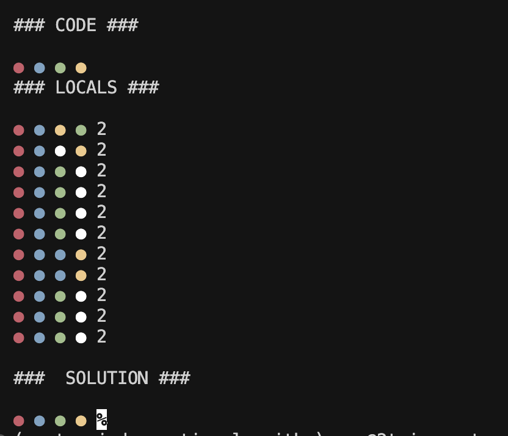
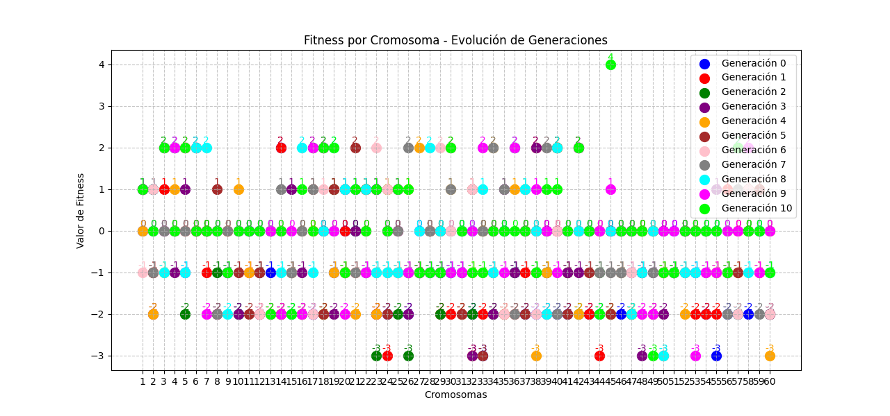
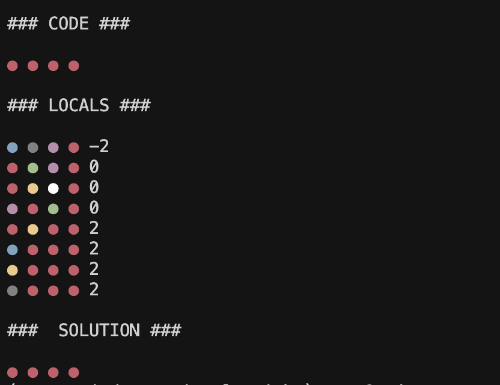
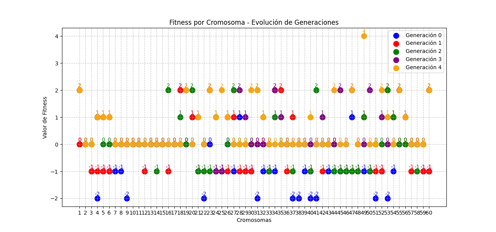

Resolviendo Mastermind mediante algoritmos genéticos
====================================================

## Instalación y Configuración

### Requisitos Previos
- Python ≥ 3.11
- [uv](https://github.com/astral-sh/uv) (gestor de paquetes de Python)

### Instalación

1. Clonar el repositorio:
```bash
git clone https://github.com/dfleta/mastermind-genetic-algorithm.git
cd mastermind-genetic-algorithm
```

2. Crear y activar un entorno virtual con uv:
```bash
python -m pip install uv

uv venv

source .venv/bin/activate  # En Linux/MacOS
# o
.venv\Scripts\activate     # En Windows
```

3. Instalar las dependencias:
```bash
uv sync
```

4. (Opcional) Instalar dependencias de desarrollo:
```bash
uv sync --group lint
```

### Dependencias Principales
#### Produccción:
- matplotlib >= 3.10.1
#### Desarrollo:
- ruff ≥ 0.10.0
- pytest >= 8.3.5

### Uso

`uv run main.py`

o

`python3 main.py`


## Resultados

### Rank wheel para la selección de individuos que pasan a la siguiente generación


*Código a averiguar, máximo local tras cada generación (no explorado aun) con el valor de la función fitness y máximo global.*


*Fitness de cada individuo en cada generación.*


*Código a averiguar, máximo local tras cada generación (no explorado aun) con el valor de la función fitness y máximo global.*

### Elitismo en la selección de individuos que pasan a la siguiente generación


*Al emplear elitismo, los individuos con peor fitness desaparecen de las generaciones posteriores*
