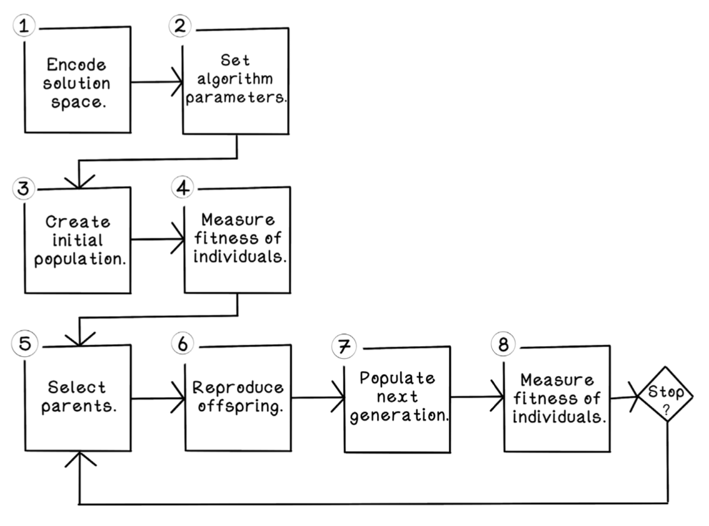

Resolviendo Mastermind mediante algoritmos genéticos
====================================================

## Contexto
[Texto generado por Claude]

Mastermind es un juego de mesa de deducción donde un jugador (el codificador) crea un código secreto usando una combinación de colores, y el otro jugador (el decodificador) intenta adivinarlo mediante propuestas sucesivas. Después de cada intento, el codificador proporciona retroalimentación indicando:
- Cuántos colores están en la posición correcta (clavijas negras)
- Cuántos colores correctos están en posición incorrecta (clavijas blancas)

Este problema representa un desafío de optimización combinatoria donde:
- El espacio de búsqueda es extenso (P^N posibilidades, donde P es el número de colores y N la longitud del código)
- Existe retroalimentación clara sobre la calidad de cada solución (función fitness)
- Las soluciones pueden ser "cruzadas" y "mutadas" de forma natural

Estas características hacen que el problema sea especialmente adecuado para su resolución mediante algoritmos genéticos, donde cada posible código representa un cromosoma en la población, y la retroalimentación del juego se utiliza como función de aptitud (fitness) para guiar la evolución hacia la solución óptima.

## Instalación y Configuración

### Requisitos Previos
- Python ≥ 3.11
- [uv](https://github.com/astral-sh/uv) (gestor de paquetes de Python)

### Instalación

1. Clonar el repositorio:
```bash
git clone https://github.com/dfleta/mastermind-genetic-algorithm.git
cd mastermind-genetic-algorithm
```

2. Crear y activar un entorno virtual con uv:
```bash
python -m pip install uv

uv venv

source .venv/bin/activate  # En Linux/MacOS
# o
.venv\Scripts\activate     # En Windows
```

3. Instalar las dependencias:
```bash
uv sync
```

4. (Opcional) Instalar dependencias de desarrollo:
```bash
uv sync --group lint
```

### Dependencias Principales
#### Produccción:
- matplotlib >= 3.10.1
#### Desarrollo:
- ruff ≥ 0.10.0
- pytest >= 8.3.5

### Uso

`uv run play_mastermind.py`

o

`python3 play_mastermind.py`

## Implementación
[Texto generaro por Claude]

La implementación del algoritmo genético sigue el ciclo de vida propuesto en Hurbans (2020).


*Ciclo de vida de un algoritmo genético. Figura 4.9 "Genetic algorithm life cicle" de Hurbans (2020)*

El ciclo de vida se implementa en la clase `GA` siguiendo estas etapas:

1. **Población Inicial** (`create_initial_population`):
   - Se generan 60 cromosomas aleatorios únicos
   - Cada cromosoma es una tupla de 4 colores que representa un posible código

2. **Evaluación** (`evaluate_population`, `evaluate_individual`):
   - Cada cromosoma se evalúa contra el código secreto usando la función de fitness del juego
   - La función devuelve la suma de clavijas negras y blancas (máximo global = 4)

3. **Selección de Padres** (`select_parents`, `weighted_random_choice`):
   - Se seleccionan 40 padres mediante "roulette wheel selection"
   - La probabilidad de selección es proporcional al fitness de cada cromosoma

4. **Reproducción** (`reproduce_offspring`, `single_point_crossover`):
   - Los padres se emparejan aleatoriamente
   - Cada pareja genera dos hijos mediante crossover de punto único en la posición 2
   - Los hijos se añaden a la población

5. **Mutación** (`mutation`):
   - Se muta un 10% de la población sumada al offspring (MUTATION_RATIO = 10)
   - Para cada mutación, se selecciona un gen aleatorio y se cambia por otro color

6. **Selección de Nueva Generación** (`populate_next_generation`):
   Se implementan dos estrategias:
   - **Elitismo** (`elitism_selection`): Selecciona los 60 mejores cromosomas
   - **Rank Wheel** (`rank_selection`): Selección probabilística basada en el ranking de fitness

7. **Condición de Parada** (`stopping`, `global_maximum`, `local_maximum`):
   El algoritmo se detiene cuando:
   - Se encuentra el código secreto (fitness = 4)
   - Se alcanza el número máximo de generaciones
   - Se detecta un máximo local no explorado previamente

## Resultados

### Rank wheel para la selección de individuos que pasan a la siguiente generación


*Código a averiguar, máximo local tras cada generación (no explorado aun) con el valor de la función fitness y máximo global.*


*Fitness de cada individuo en cada generación.*


*Código a averiguar, máximo local tras cada generación (no explorado aun) con el valor de la función fitness y máximo global.*

### Elitismo en la selección de individuos que pasan a la siguiente generación


*Al emplear elitismo, los individuos con peor fitness desaparecen de las generaciones posteriores*

## Referencias
Hurbans, R. (2020). _Grokking Artificial Intelligence Algorithms_. Manning Publications Co. ISBN: 9781617296185
